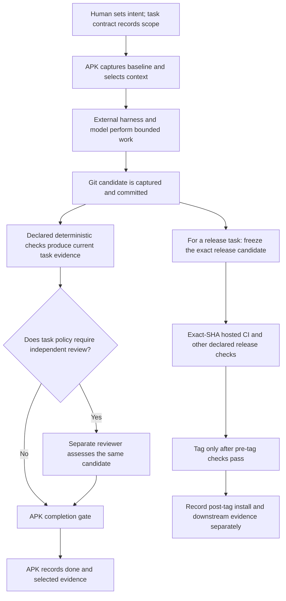

# APK concepts and trust boundaries

Agentic Project Kit (APK) keeps an AI-assisted development workflow reviewable in the repository. Project documentation, configuration, task contracts, and lifecycle records are shared inputs to the workflow; chat history is not the project database. This page explains the concepts behind the workflow. The [task system](task-system.md) and [CLI reference](cli-commands.md) contain the detailed contracts and command syntax.

## Repository truth and generated instructions

The repository is the shared source of truth for project goals, constraints, task plans, and workflow policy. A task contract describes one bounded unit of work: its goal, context files, allowed and forbidden paths, dependencies, acceptance criteria, and verification requirements.

APK selects context from the task contract and repository docs, then prepares a prompt or vendor-neutral worker package. Context selection is explicit and bounded; it does not make every file in the repository part of the task. See the [context system](context-system.md).

`AGENTS.md` is a generated rendering of common agent guidance. Claude and Gemini use thin import files; other supported tools read `AGENTS.md` directly. These files help a harness follow the repository workflow, but they are guidance, not enforcement. Internal docs/config remain the policy source, while APK's parser, verification, scope checks, and completion gate enforce task contracts ([exporter rules](agent-exporters.md), [ADR-0040](decisions.md#adr-0040---canonical-agentsmd-export-with-thin-harness-adapters)).

## Task, candidate, and evidence

When a task is claimed, APK captures its baseline and owner. Work changes the candidate: the baseline-to-candidate content, current Git state, and worktree identify the revision being evaluated. A candidate is not just a task ID or the latest model response. Git provides commit/tree identity where available; APK binds verification and review evidence to the task, baseline, candidate, worktree, and repository revision.

Task verification comes from checks declared in the contract. APK can run eligible automated checks and record their results. A human or external system can provide an observed result only through the supported recording path for a declared check. A model's claim that something passed is not itself verification evidence.

Task evidence is append-only and revision-bound. For the current candidate, APK classifies evidence as current, stale, or unknown. A prior PASS for another candidate remains in history but cannot satisfy the current gate. Missing, failed, unavailable, not-run, stale, or ambiguous required evidence does not become PASS. See [verification and evidence](task-system.md#verification-contract) and [evidence records](task-system.md#evidence-records).

Hosted CI and release validation answer different questions from a task's local verification. CI can prove that an exact checked-out SHA works in a clean checkout; its status is separate evidence and counts only where the contract records the expected result. Release validation freezes one exact candidate and checks its release-specific requirements before a tag; post-tag install and downstream observations are recorded separately. A green CI run or tag does not silently replace the task's declared checks, required review, or completion gate ([testing strategy](engineering/testing-strategy.md#clean-checkout-ci), [release evidence ordering](engineering/testing-strategy.md#release-evidence-ordering)).

## Review, gate, and provenance

Task policy decides whether independent review is required based on task risk, classification, and assurance rules. When required, a reviewer uses a different registered identity and reviews the prepared candidate in a separate context. Review runs after deterministic checks; it is candidate-bound, and a later implementation change makes the old review stale. A PASS is an informed assessment of the contract and change, not a mathematical proof of correctness.

The completion gate evaluates one task subject using its dependencies, policy, attributed scope, current required verification/evidence, and any required current review. `apk done` uses that same evaluator and records the exact evidence set. There is no general force-completion path. Task-specific evidence and the final completion decision are inspectable through bounded provenance, which joins existing task, agent, Git, run, and evidence records without becoming a second source of policy ([gate](task-system.md#completion-gate), [provenance](task-system.md#task-provenance)).

## Who owns what

| Actor or artifact | Responsibility | Trust boundary | Source |
| --- | --- | --- | --- |
| Human/operator | Sets goals and priorities, resolves product choices, and supplies explicit human decisions when a contract requires them. | APK records operator-asserted decisions; it does not authenticate a person or invent consent. | [Human decisions](task-system.md#human-decisions-for-review-budget-exhaustion) |
| APK CLI | Reads repository policy and task contracts, selects context, captures lifecycle/candidate identity, runs eligible declared checks, records supported evidence, and evaluates scope and completion gates. | It orchestrates semantic workflow state; it does not launch or host a model. | [Work loop](task-system.md#cli-work-loop), [completion gate](task-system.md#completion-gate) |
| Coding harness | Runs its tool session, applies repository changes, and returns a result against the issued task package. | Its result is orchestration/provenance input. It does not replace canonical verification or prepared review evidence. | [Worker handoff](task-system.md#model-agnostic-worker-handoff) |
| Model | Produces proposed code, analysis, or review text within the harness. | Model output is not trusted merely because it sounds confident or says checks passed. | [Runtime boundary](architecture.md#current-runtime-boundary), [ADR-0039](decisions.md#adr-0039---apk-is-a-repository-local-semantic-control-plane-not-an-external-runtime) |
| Git | Stores revisions and exposes commit, tree, branch, worktree, and file-state facts. | Git identifies the revision; it does not judge whether acceptance criteria are satisfied. | [Candidate evidence](task-system.md#evidence-records), [provenance](task-system.md#task-provenance) |
| Hosted CI | Runs configured checks in a clean environment for a checked-out SHA. | CI proves only its recorded run and SHA; it is not a substitute for unrelated task or release evidence. | [Clean-checkout CI](engineering/testing-strategy.md#clean-checkout-ci) |
| Generated instructions | Carry common repository guidance to compatible tools. | Generated files are derived guidance, not the policy source and not a security boundary. | [Exporter source](agent-exporters.md#source-of-truth), [ADR-0040](decisions.md#adr-0040---canonical-agentsmd-export-with-thin-harness-adapters) |

## One task through release validation

Task verification and release validation are related but separate lanes. Review is conditional on policy; deterministic checks remain required wherever the task contract declares them. Candidate mutation invalidates evidence tied to the earlier candidate.

## Resources, workers, and worktrees

The optional resource registry describes models, harnesses, and executable worker identities with capabilities, availability, capacity, and non-secret metadata. Routing can choose or explain a role assignment. APK does not probe providers, hold credentials, execute models, or claim that a declared worker is live ([resource-aware execution](execution-profiles.md#resource-model), [ADR-0034](decisions.md#adr-0034---execution-profile-is-independent-and-assurance-is-resource-aware)).

APK-managed workspaces are Git worktrees bound to task/run and repository identity. They provide a safe boundary for file changes; they are not process, terminal, model-session, or remote-machine isolation. An external runtime may use a worktree path as its working directory. The [runtime boundary](architecture.md#current-runtime-boundary) and [deferred dogfood plan](execution-profiles.md#external-runtime-dogfood-deferred) describe that separation.

## Further reading

- [Project scope](scope.md) for current capabilities, non-goals, and historical plans.
- [Architecture](architecture.md) for current ownership and deferred/excluded design.
- [Task system](task-system.md) for exact lifecycle, verification, evidence, review, gate, and provenance behavior.
- [Testing strategy](engineering/testing-strategy.md) for local checks, CI, and frozen-release evidence.
